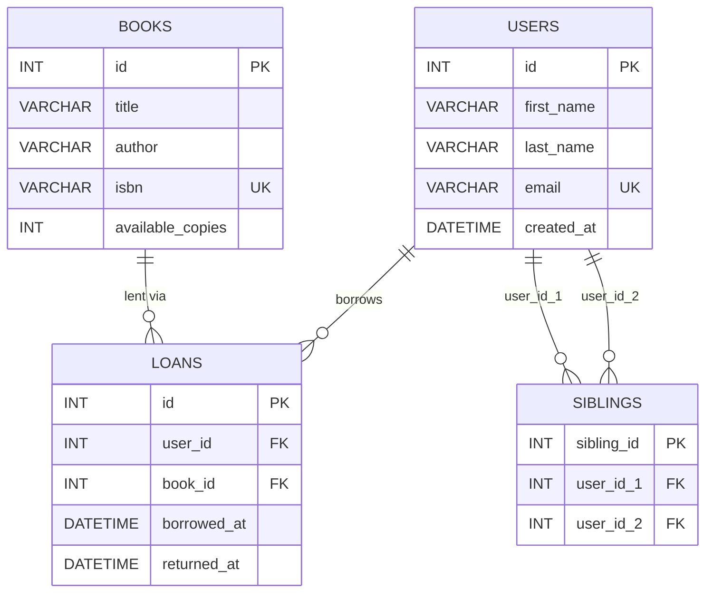

# Library Management System

A production-ready Library Management System built with Python, Flask, SQLAlchemy, and MySQL 8.

## Table of Contents
- [Overview](#overview)
- [Tech Stack](#tech-stack)
- [Project Structure](#project-structure)
- [Setup & Installation](#setup--installation)
- [Environment Variables](#environment-variables)
- [Database Configuration](#database-configuration)
- [Running the Application](#running-the-application)
- [Manual Functionality Testing Guide](#manual-functionality-testing-guide)
- [API Documentation](#api-documentation)

## Overview

This system manages:
- **Users**: Creating and managing library members.
- **Books**: managing book inventory.
- **Loans**: handling borrowing and returning of books (User <-> Book).
- **Siblings**: managing sibling relationships between users (User <-> User).

The application follows a RESTful API design and is built using the Flask Application Factory pattern.

## Entity Relationship Diagram




## Tech Stack

- **Language**: Python 3.x
- **Framework**: Flask
- **Database**: MySQL 8.0.45
- **ORM**: SQLAlchemy
- **WSGI Server**: Gunicorn

## Project Structure

```
.
├── app
│   ├── __init__.py          # App factory
│   ├── extensions.py        # Flask extensions (db)
│   ├── models.py            # Database models
│   ├── routes               # API routes (Blueprints)
│   │   ├── __init__.py
│   │   ├── book_routes.py
│   │   ├── loan_routes.py
│   │   ├── sibling_routes.py
│   │   └── user_routes.py
│   └── utils.py             # Utility functions
├── config.py                # Configuration classes
├── requirements.txt         # Dependencies
├── run.py                   # Application entry point
├── Procfile                 # Heroku deployment file
├── init_db.py               # Database initialization script
└── README.md
```

## Setup & Installation

1.  **Clone the repository:**
    ```bash
    git clone <repository_url>
    cd <repository_name>
    ```

2.  **Create a virtual environment:**
    ```bash
    python3 -m venv venv
    source venv/bin/activate
    ```

3.  **Install dependencies:**
    ```bash
    pip install -r requirements.txt
    ```

## Environment Variables

Create a `.env` file in the root directory (do not commit this file).

```ini
SECRET_KEY=your_secret_key_here
FLASK_APP=run.py
FLASK_CONFIG=development

# Database Configuration
DB_USER=root
DB_PASSWORD=your_password
DB_HOST=localhost
DB_PORT=3306
DB_NAME=library_db
```

## Database Configuration

Ensure you have MySQL 8.0.45 installed and running.

1.  **Configure Environment**: Update your `.env` file with your MySQL credentials.
2.  **Initialize Database**: Run the initialization script to create the database and tables automatically:
    ```bash
    ./venv/bin/python init_db.py
    ```

## Running the Application

### Development
```bash
./venv/bin/python run.py
```
The API will be available at `http://localhost:5000`.

### Production (using Gunicorn)
To run the server in a production-like environment:

```bash
./venv/bin/gunicorn -w 4 -b 0.0.0.0:8000 run:app
```

Then visit `http://localhost:8000` in your browser.

## Manual Functionality Testing Guide

Follow these steps to verify the system is working correctly through the Web UI:

### 1. User Management (`/users`)
- **Add User**: Fill in a name and a unique email. Click "Create User".
- **Verify**: The new user should appear in the table below.
- **Error Check**: Try adding the same email again; you should see an error message.

### 2. Book Management (`/books`)
- **Add Book**: Fill in title, author, a unique ISBN, and the number of copies.
- **Verify**: The book should appear in the inventory table.
- **Error Check**: Try adding a book with an existing ISBN.

### 3. Loan Management (`/loans`)
- **Lend a Book**: Select a user and a book from the dropdowns. Click "Lend".
- **Verify**: The loan should appear in the "History" table with an "Active" status. The book copies count should decrease.
- **Return a Book**: Click the "Return" button on an active loan.
- **Verify**: The "Returned At" column should update.

### 4. Sibling Management (`/siblings`)
- **Connect Users**: Select two different users from the dropdowns. Click "Establish Relationship".
- **Verify**: The relationship should appear in the table.
- **Delete**: Click "Delete" to remove the relationship.

## API Documentation

All responses are in JSON format.

### Common Responses
- `200 OK`: Success
- `201 Created`: Resource created successfully
- `400 Bad Request`: Validation error
- `404 Not Found`: Resource not found
- `409 Conflict`: Duplicate entry or constraint violation
- `500 Server Error`: Internal error

### Endpoints

#### Users
- `GET /users` - List all users
- `GET /users/<id>` - Get user details
- `POST /users` - Create user
  - Body: `{"first_name": "John", "last_name": "Doe", "email": "john@example.com"}`
- `PUT /users/<id>` - Update user (partial updates supported, cannot update ID)
- `DELETE /users/<id>` - Delete user

#### Books
- `GET /books` - List all books
- `GET /books/<id>` - Get book details
- `POST /books` - Add book
  - Body: `{"title": "Book Title", "author": "Author Name", "isbn": "12345", "available_copies": 5}`
- `PUT /books/<id>` - Update book
- `DELETE /books/<id>` - Delete book

#### Loans
- `GET /loans` - List all loans
- `GET /loans/<id>` - Get loan details
- `POST /loans` - Create loan (Checkout)
  - Body: `{"user_id": 1, "book_id": 1}`
- `PUT /loans/<id>` - Update loan (Return)
  - Body: `{"returned_at": "2023-10-27T10:00:00"}`
- `DELETE /loans/<id>` - Delete loan record

#### Siblings
- `GET /siblings` - List all sibling relationships
- `POST /siblings` - Create sibling relationship
  - Body: `{"user_id_1": 1, "user_id_2": 2}`
- `DELETE /siblings/<id>` - Remove sibling relationship

